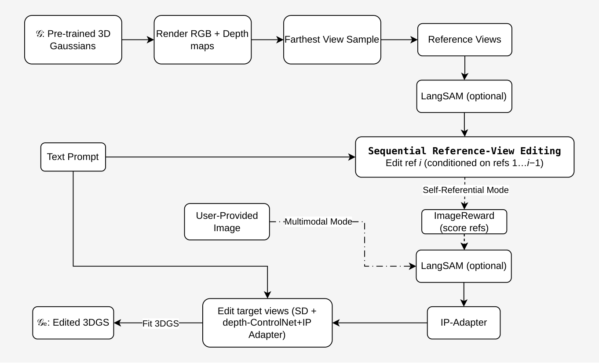

<h1 align="center">MultiSplat</h1>

<p align="center">
  <em>Multimodal text- and image-guided 3D Gaussian Splatting scene editing — multi-view consistent, no per-frame flicker.</em>
</p>

<p align="center">
  <a href="#citation">Thesis PDF (TODO)</a> ·
  <a href="https://github.com/manolisfosteris/multisplat/tree/Seq_Ref_IP_Adapter">Seq_Ref_IP_Adapter branch</a> ·
  <a href="#license">License</a>
</p>

<p align="center">
  
</p>

<p align="center"><sub>Same prompt, two conditioning modes. Adding a reference image locks the visual style down, and the result stays coherent across every view of the 3D scene.</sub></p>

---

## Abstract

Text-driven 3D Gaussian Splatting (3DGS) editors are powerful but ambiguous: a single prompt like *"a polar bear in a forest"* can describe wildly different-looking scenes, and multi-view consistency degrades quickly when reference views drift from each other. **MultiSplat** couples an IP-Adapter for style control with a *sequential* reference-view editing loop on top of the GaussCtrl framework. A single reference image (or an automatically self-selected one) pins down the visual style; reference frames are edited one at a time, each attending to the already-edited earlier ones, so the target views see a coherent set of references and multi-view consistency stays tight. Reference views are chosen with Farthest View Sampling for wider geometric coverage. All contributions run on the standard Stable Diffusion 1.5 + depth-ControlNet + `splatfacto` stack — no retraining of the diffusion model, no auxiliary networks beyond the off-the-shelf IP-Adapter and ImageReward scorer.

---

## Overview

Two ideas make text- and image-guided 3D editing practical:

- **Reference-image style control.** An IP-Adapter runs on the diffusion editor's cross-attention (`attn2`) while cross-view attention runs on `attn1` — the two mechanisms coexist without interference. A single reference image locks the target style.
- **Sequential reference-view editing.** Reference frames are edited one at a time — ref 0 sets the style; ref 1 attends to the already-edited ref 0; ref 2 attends to edited refs 0–1; and so on. Every subsequent target view then attends to a coherent set of edited references, giving markedly tighter multi-view consistency than editing all references in one shot.

Two operating modes ship out of the box:

- **Multimodal Mode** — you provide the reference image.
- **Self-Referential Mode** — no external image; the system scores its own intermediate edits with [ImageReward](https://github.com/THUDM/ImageReward), picks the strongest one, and reuses it as the IP-Adapter input. The scene bootstraps its own style anchor.

---

## Multimodal editing in action

Feed the system any reference image and a matching text prompt — the entire 3D scene is edited to match both.

<p align="center">
  
</p>

<p align="center"><sub>A single reference image is enough to pin down species, material, and lighting the text prompt can only gesture at.</sub></p>

---

## Multi-view consistency

Sequential reference-view editing keeps the style locked across every rendered viewpoint.

<p align="center">
  
</p>

<p align="center">
  
</p>

<p align="center"><sub>Six rendered viewpoints per row from the edited 3DGS scenes — Picasso, Van Gogh, jade horse, and terracotta warrior. All are 3D renders of the fine-tuned scene.</sub></p>

---

## How it works

<p align="center">
  
</p>

1. **Render** RGB + depth for all training views from the pretrained 3DGS scene and DDIM-invert them to noisy latents.
2. **Sample references** — pick 4 reference views by **Farthest View Sampling** (greedy spatial + angular diversity). Wider geometric coverage feeds cross-view attention.
3. **Segment** (optional) — [LangSAM](https://github.com/luca-medeiros/lang-segment-anything) extracts an object mask per view so edits are composited over the original background.
4. **Sequentially edit references** with cross-view attention. Each new ref attends to the already-edited ones, DDIM-re-inverted between steps.
5. **Pick the IP-Adapter input** — *Self-Referential Mode*: score edited refs with ImageReward and use the best one. *Multimodal Mode*: use the user-provided image directly. LangSAM (optional) segments the chosen reference.
6. **Edit target views** in chunks with SD 1.5 + depth-ControlNet + IP-Adapter, attending to the edited reference latents on `attn1`.
7. **Fit** `splatfacto` on the edited views for 500 more steps with L1 + LPIPS.

---

## Installation

Tested on CUDA 11.8 + Ubuntu 22.04 + NeRFStudio 1.0.0 + NVIDIA V100 / RTX A5000 (24 GB).

### Conda

```bash
git clone https://github.com/manolisfosteris/multisplat.git
cd multisplat

conda create -n multisplat python=3.8
conda activate multisplat
conda install cuda -c nvidia/label/cuda-11.8.0

# Torch + tiny-cuda-nn
pip install torch==2.1.2+cu118 torchvision==0.16.2+cu118 --extra-index-url https://download.pytorch.org/whl/cu118
pip install ninja git+https://github.com/NVlabs/tiny-cuda-nn/#subdirectory=bindings/torch

# NeRFStudio + gsplat
pip install nerfstudio==1.0.0
pip install gsplat==0.1.3
pip install -r requirements.txt
pip install "huggingface_hub<0.24"

# Lang-SAM (specific branch, no-deps)
cd ..
git clone https://github.com/luca-medeiros/lang-segment-anything && cd lang-segment-anything
git checkout fix-no_detection
pip install --no-deps --no-build-isolation .
pip install groundingdino-py segment-anything

# This project
cd ../multisplat
pip install -e .
```

Verify: `ns-train -h` (you should see `multisplat` in the method list).

If `tiny-cuda-nn` fails to build, see the [official build-from-source notes](https://github.com/NVlabs/tiny-cuda-nn/?tab=readme-ov-file#compilation-windows--linux). NeRFStudio v1.0.0 with gsplat v0.1.3 is the recommended pairing.

---

## Data

MultiSplat operates on scenes formatted the same way as NeRFStudio (`nerfstudio-data`). A scene folder needs:

```
data/my_scene/
  images/               # RGB training images
  transforms.json       # NeRFStudio camera format (COLMAP or manual)
  sparse_pc.ply         # optional but recommended: sparse point cloud from COLMAP
  camera_paths/         # optional: JSON files for render-path videos
```

The six upstream demo scenes (`bear`, `dinosaur`, `face`, `fangzhou`, `garden`, `stone_horse`) are included pre-processed under `data/`. To use your own scene, run COLMAP through `ns-process-data` or the equivalent.

---

## Usage

### 0 — Base 3DGS model (prerequisite)

Train a `splatfacto` model on your scene. This is a one-time cost per scene; the editor works from the pretrained checkpoint.

```bash
ns-train splatfacto --output-dir unedited_models --experiment-name my_scene nerfstudio-data --data data/my_scene
```

### Multimodal Mode — text prompt + reference image

```bash
ns-train multisplat --load-checkpoint unedited_models/my_scene/splatfacto/{TIMESTAMP}/nerfstudio_models/step-000029999.ckpt --experiment-name my_scene_edit --output-dir outputs --pipeline.datamanager.data data/my_scene --pipeline.edit_prompt "a photo of a bronze bust statue of a man" --pipeline.reverse_prompt "a photo of a man" --pipeline.guidance_scale 5 --pipeline.chunk_size 1 --pipeline.langsam_obj "man" --pipeline.ip_adapter_image_path "assets/ip_references/bronze_bust.jpeg" --pipeline.ip_adapter_scale 0.6
```

### Self-Referential Mode — no external image

```bash
ns-train multisplat --load-checkpoint unedited_models/bear/splatfacto/{TIMESTAMP}/nerfstudio_models/step-000029999.ckpt --experiment-name polar_bear --output-dir outputs/bear --pipeline.datamanager.data data/bear --pipeline.edit_prompt "a photo of a polar bear in the forest" --pipeline.reverse_prompt "a photo of a bear in the forest" --pipeline.guidance_scale 5 --pipeline.chunk_size 1 --pipeline.langsam_obj "bear" --pipeline.auto_ip_from_refs True --pipeline.ip_adapter_scale 0.6
```

### Render the edited scene

```bash
# Dataset viewpoints
ns-multisplat-render dataset --load-config outputs/.../config.yml --output_path render/my_scene_edit

# Camera-path video
ns-multisplat-render camera-path --load-config outputs/.../config.yml --camera-path-filename data/my_scene/camera_paths/render-path.json --output_path render/my_scene_edit.mp4
```

### Evaluate

```bash
python metrics/evaluate.py --edited_dir render/my_scene_edit/rgb --original_dir render/original_my_scene/rgb --edit_prompt "..." --reverse_prompt "..."
```

Reports `clip_score` (edited↔prompt), `clip_dir` (directional CLIP similarity), and `clip_img` (edited↔original image similarity).

### Key CLI flags

| Flag | Meaning |
|---|---|
| `--pipeline.ip_adapter_image_path` | Reference image for IP-Adapter |
| `--pipeline.ip_adapter_scale`      | IP-Adapter influence (0 = text only, 1 = image only) |
| `--pipeline.auto_ip_from_refs`     | Auto-pick best edited ref as IP-Adapter input (Self-Referential Mode) |
| `--pipeline.langsam_obj`           | LangSAM target for the scene object |
| `--pipeline.ip_langsam_obj`        | LangSAM target for the reference image (`"none"` disables) |
| `--pipeline.ref_view_selection`    | `"fvs"` (default) or `"random"` |
| `--pipeline.fvs_alpha`             | FVS angular-distance weight (default 1.0) |
| `--pipeline.debug_dir`             | Where per-view edited images are written (default `outputs/debug_edited_images`) |

---

## Results

CLIP-based metrics on the standard GaussCtrl demo scenes. Baseline is the upstream GaussCtrl editor at the same random seed; `↑` means higher is better.

| Scene | Edit prompt | Method | clip_score ↑ | clip_dir ↑ | clip_img ↑ |
|---|---|---|---|---|---|
| bear | polar bear in the forest | GaussCtrl                     | TODO | TODO | TODO |
| bear | polar bear in the forest | MultiSplat (Multimodal)       | TODO | TODO | TODO |
| bear | polar bear in the forest | MultiSplat (Self-Referential) | TODO | TODO | TODO |
| face | bronze bust of a man     | GaussCtrl                     | TODO | TODO | TODO |
| face | bronze bust of a man     | MultiSplat (Multimodal)       | TODO | TODO | TODO |

Ablations on the contribution of each component (sequential-ref editing, IP-Adapter, FVS, cross-view attention) are reported in the thesis (TODO: link).

---

## Repository tour

| File | Role |
|---|---|
| `multisplat/pipeline.py`    | Orchestrates render → invert → edit → train. Hosts `select_reference_views_fvs`, `_load_ip_adapter`, `_auto_select_ip_from_refs`, `_build_combined_attn_procs`, `edit_reference_views_sequential`, `edit_images`. |
| `multisplat/utils.py`       | `CrossViewAttnProcessor` — custom diffusers attention processor that replaces UNet `attn1` self-attention with cross-view attention over the reference frames. |
| `multisplat/trainer.py`     | Extends NeRFStudio's `Trainer` with a short 500-step fine-tuning loop after editing. |
| `multisplat/datamanager.py` | Subsamples 40 training views; stores per-view depth / z₀ latent / mask / unedited / edited image. |
| `multisplat/model.py`       | `MultiSplatModel` — extends `SplatfactoModel` with LPIPS + L1 losses. |
| `multisplat/config.py`      | Registers `"multisplat"` as a NeRFStudio method. |
| `metrics/evaluate.py`       | CLIP evaluation (`clip_score`, `clip_dir`, `clip_img`). |

---

## Citation

If you use MultiSplat, please cite:

```bibtex
@mastersthesis{fosteris2026multisplat,
  title  = {MultiSplat: Multimodal Text and Image-Guided 3D Gaussian Splatting Editing},
  author = {Fosteris, Manolis},
  school = {TODO},
  year   = {2026},
  note   = {TODO: thesis URL}
}
```

---

## Acknowledgments

MultiSplat builds directly on [GaussCtrl](https://github.com/ActiveVisionLab/gaussctrl) (Wu et al., ECCV 2024) — the render→invert→edit→retrain pipeline, the cross-view attention formulation, and the demo scenes come from that work.

```bibtex
@inproceedings{wu2024gaussctrl,
  title     = {{GaussCtrl}: Multi-View Consistent Text-Driven {3D} {G}aussian Splatting Editing},
  author    = {Wu, Jing and Bian, Jia-Wang and Li, Xinghui and Wang, Guangrun and Reid, Ian and Torr, Philip and Prisacariu, Victor Adrian},
  booktitle = {European Conference on Computer Vision (ECCV)},
  year      = {2024}
}
```

Additional third-party components:

- **NeRFStudio** — training loop, camera / dataparser abstractions ([Tancik et al., SIGGRAPH 2023](https://docs.nerf.studio/)).
- **gsplat** — differentiable Gaussian rasterization ([Ye et al., 2024](https://github.com/nerfstudio-project/gsplat)).
- **IP-Adapter** — image-prompt cross-attention for Stable Diffusion ([Ye et al., 2023](https://github.com/tencent-ailab/IP-Adapter)).
- **ImageReward** — self-referential reward scoring for reference selection ([Xu et al., NeurIPS 2023](https://github.com/THUDM/ImageReward)).
- **NeRF Director** — Farthest View Sampling algorithm ([Xiao et al., CVPR 2024](https://arxiv.org/abs/2406.08839)).
- **lang-segment-anything** — text-prompted masking of scene and reference images ([Medeiros](https://github.com/luca-medeiros/lang-segment-anything)).

---

## License

BSD 3-Clause — see [`LICENSE.txt`](LICENSE.txt). Original GaussCtrl copyright is preserved verbatim; MultiSplat additions carry a separate copyright line.
